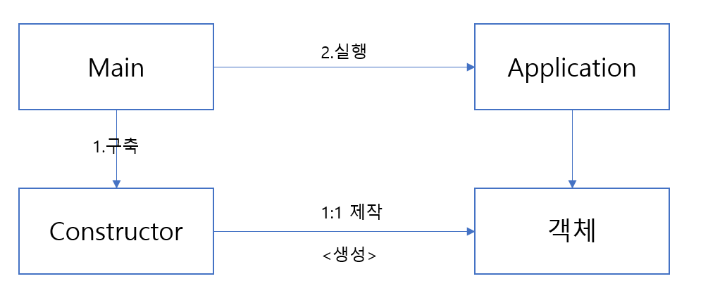
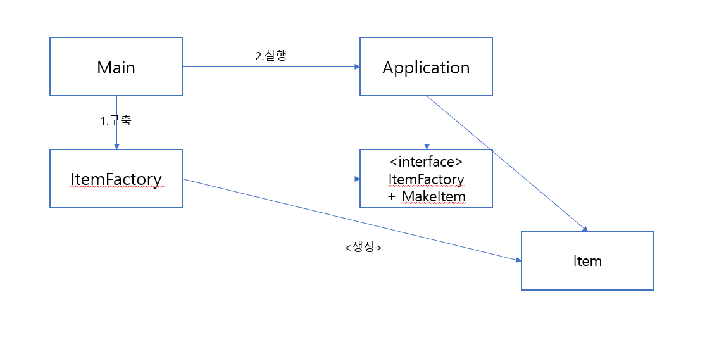

# 11장 시스템

깨끗한 코드를 구현하면 낮은 추상화 수준에서 쉽게 관심사를 분리 가능
높은 추상화 수준 -> 시스템 수준에서 깨끗함을 유지하는 방법

### 시스템 제작과 시스템 사용을 분리하라

- construction과 use는 아주 다름
- 관심사 분리 -> 중요한 설계 기법

```
public Service getService() {
    if(service == null)
        service = new MyServiceImpl(...);
    return service;
}
```
- 위 방식은 초기화 지연 / 계산 지연이라는 기법
    - 실제 필요할 때까지 객체를 생성하지 않으므로 불필요한 부하가 걸리지 않음
    - 어떠한 경우에도 null 포인터를 반환하지 않음
- 하지만 생성자 인수에 명시적으로 의존하기 떄문에 해결하지 않으면 컴파일이 안된다.
- 또한 테스트 과정에서 mock 객체를 service에 할당해야 한다
    - 해당 코드는 service에 대한 경로도 갈래가 있음
    - 런타임 로직에 생성자 로직이 섞여 있음
    - 이는 책임이 둘이고 메서드가 2가지 이상의 작업 수행 요구
- 따라서 의존성을 해결하는 방법 -> 설정 논리 / 일반 논리를 분리해야 모듈성이 높아짐


### Main 분리

- 시스템 생성과 시스템 사용을 분리하는 방법
- 생성과 관련된 코드는 main이나 main이 호출하는 모듈로 이동



- 메인 함수는 위 그림에서 객체가 생성되는 과정을 모른다

### 팩토리

- 객체가 생성되는 시점을 어플리케이션이 결정할 필요성이 생긴다
- 이때 Abstract factory 패턴을 이용
- Item을 생성하는 시점은 Application이 정하지만 생성하는 코드는 모른다



- application은 item 이 생성되는 구체적인 방법을 모른다
- 그럼에도 생성 시점은 통제가 가능하고 생성자 인수도 넘기기 가능

### 의존성 주입

