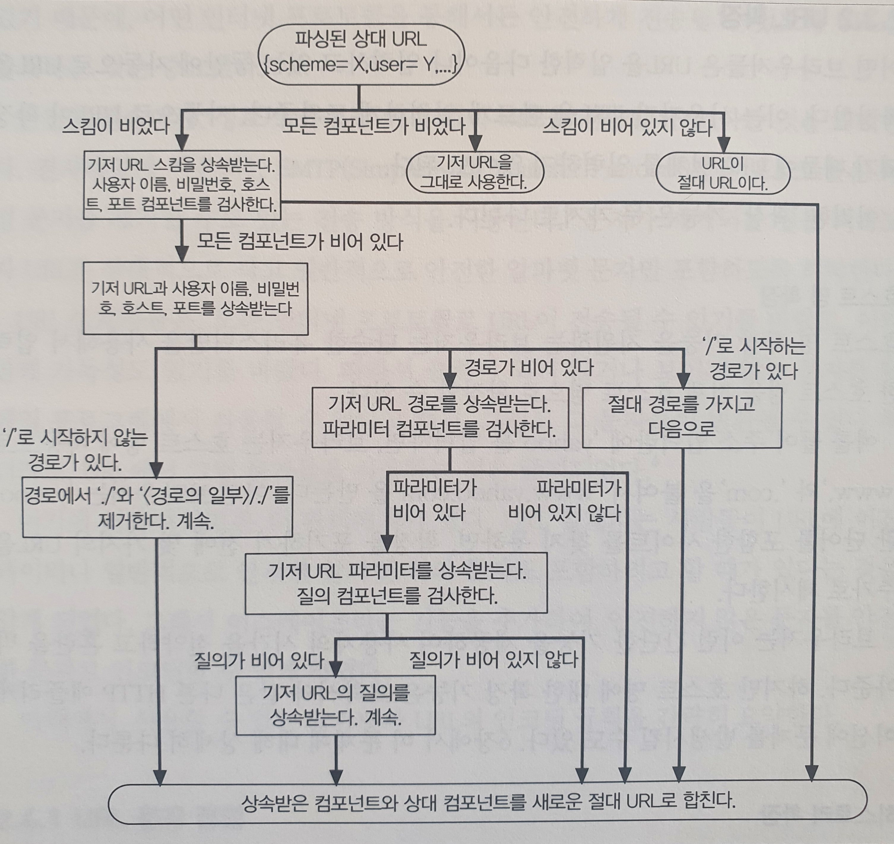

# URL과 리소스

- URL 문법과 컴포넌트의 의미
- 단축 URL
- URL 인코딩 문자 규칙
- URL 스킴
- URN과 URL의 미래

1. 리소스의 탐색

    - http는 URL의 스킴 -> 리소스 접근 방법 명세 (How)
    - www.xxxx.com 은 서버의 위치 (Where)
    - /ilovecoding/keyboard.gif는 로컬에서 리소스 탐색 (What)

2. URL의 문법

    URL의 문법은 일반적으로 9개로 나뉨

    <스킴>://<사용자이름>:<비밀번호>@<호스트>:<포트>/<경로>;<파라미터>?<질의>#<프래그먼트>

    - 스킴 : 접근 프로토콜
    - 호스트 : 호스트명 혹은 주소
    - 포트 : 서버가 열어놓은 포트 번호
    - 경로 : 서버 내의 리소스의 경로
    - 파라미터 : 이름/값을 쌍으로 가지는 값
    - 질의 : DB/게시판에 파라미터 혹은 조건을 전달하는 데에 사용하는 값
    - 프래그먼트 : 리소스의 조각이나 일부분을 가리키는 이름

    2.1 사용자의 이름과 비밀 번호
    
        FTP 통신 같이 이름과 비밀번호를 요구하는 URL 스킴을 사용할 때 만약 값이 없을 경우에는 아이디에는 anonymous / 비밀번호는 브라우저의 기본값을 넣음
        아이디와 비밀번호 사이에는 :를 넣어 구분

    2.2 파라미터

        어플리케이션이 서버에 정확하게 요청하기 위해 추가적으로 필요한 입력 파라미터
        ; 뒤에 붙여서 www.xxxx.com/server;type=client 처럼 key/value 처럼 사용

    2.3 질의 문자열

        요청 받을 리소스의 범위를 좁히기 위해 사용하는 문자열
        key-value 형태로 필터를 주기 위한 문자열로 생각하면 됩니다
    
    2.4 프래그먼트

        리소스 내부에 있는 리소스의 일부를 보여주기 위한 내용으로 서버로 전송하지 않고 클라이언트에서만 사용하는 구문 

3. 단축 URL

    3.1 절대 URL과 상대 URL

    - 절대 URL : 리소스에 접근하는 데에 필요한 모든 정보를 담고 있음
    - 상대 URL : URL을 짧게 표현하는 방식

        ```
        ./sangyun.jpeg 처럼 현재 리소스 기준 위치를 표시
        ```

    브라우저는 이를 인식하고 절대 URL로 변환이 가능해야 한다
    이를 위해 기저 URL을 기준으로 상대적으로 변환한다

    ### 기저 URL을 가져오는 방법
        
        1. 리소스에서 명시적으로 제공
        2. 리소스를 포함하고 있는 기저 URL
        3. 없는 경우 (불완전하거나 깨진 경우가 많음)

    ### 상대 참조 해석하기
        
    

    3.2 URL 확장

        URL을 빨리 입력하기 위한 기능

        3.2.1 호스트명 확장

        휴리스틱을 사용하여 전체 호스트명으로 확장
        naver을 입력하면 www.naver.com을 완성해주는 기능

        3.2.2 히스토리 확장

        브라우저에서 히스토리를 사용하여 전체 url을 제공하고 사용자는 이를 선택

    3.3 안전하지 않은 문자

        URL은 호환을 잘하기 위해 설계 되었음
        SMTP같은 프로토콜의 경우에는 특정 문자를 인코딩의 종류에 따라 특정 문자를 제거하기 때문에 안전한 문자로 변환하여 전송
        따라서 이스케이프를 통해서 안전한 문자로 인코딩을 함

        - 인코딩 체계
        
            %로 시작해서 아스키 코드로 표현되는 16진수로 이루어진 이스케이프
            문자로 변환

        - 필수 인코딩 문자 목록

            % - 이스케이프 토큰
            / - 경로 세그멘트를 나누는 용도
            . - 경로 세그멘트
            # - 프래그멘트 구획
            ? - 쿼리 구획
            ; - 파라미터 구획
            : - 스킴, 아이디/패스워드, 호스트/포트 구획
            $+ - 선점(그냥이라는 뜻)
            @&= - 특정 스킴에서 특별한 의미가 있음
            {}|\~[]` - 게이트웨이 및 다른 에이전트에서 불안전함
            <> - URL 범위 밖에서 역할이 있음

4. 스킴 목록

    4.1 http

        일반 URl 포맷을 지키는 하이퍼텍스트 전송 프로토콜
        http://<host>:<port>/<path>?<query>#<fragment>

    4.2 https

        http와 같고 SSL을 적용한 형태로 기본 포트는 443임
        https://<host>:<port>/<path>?<query>#<fragment>

    4.3 mailto

        
        이메일 주소를 가리키는 URL, 해당 문법은 RFC 822에 기술
        mailto:<address>

    4.4 ftp

        파일 전송 프로토콜로 FTP 서버에 있는 파일을 다운로드하거나 업로드하는 용도로 사용
        ftp://<username>:<password>@<host>:<port>/<path>;<parameter>

    4.5 rtsp, rtspu

        실시간 스트리밍 프로토콜로 미디어 리소스 식별자
        rtsp://<username><password>:<host>:<port>/<path>
    
    4.6 file

        호스트에서 바로 접근할 수 있는 파일들
        file://<host>/<path>

    4.7 news

        뉴스 그룹에 접근하는 데에 사용하는 식별자
        news:<newsgroup>
        news:<news-article-id>

    4.8 telnet

        대화형 서비스에 접근하는 데에 사용하는 식별자 프로토콜
        telnet://<username>:<password>@<host>:<port>/

5. URN

    객체의 위치와 무관하게 객체를 가리키는 실제 객체 이름을 명명하는 프로토콜
    새로운 표준 작업이며 URL과 병행 가능함