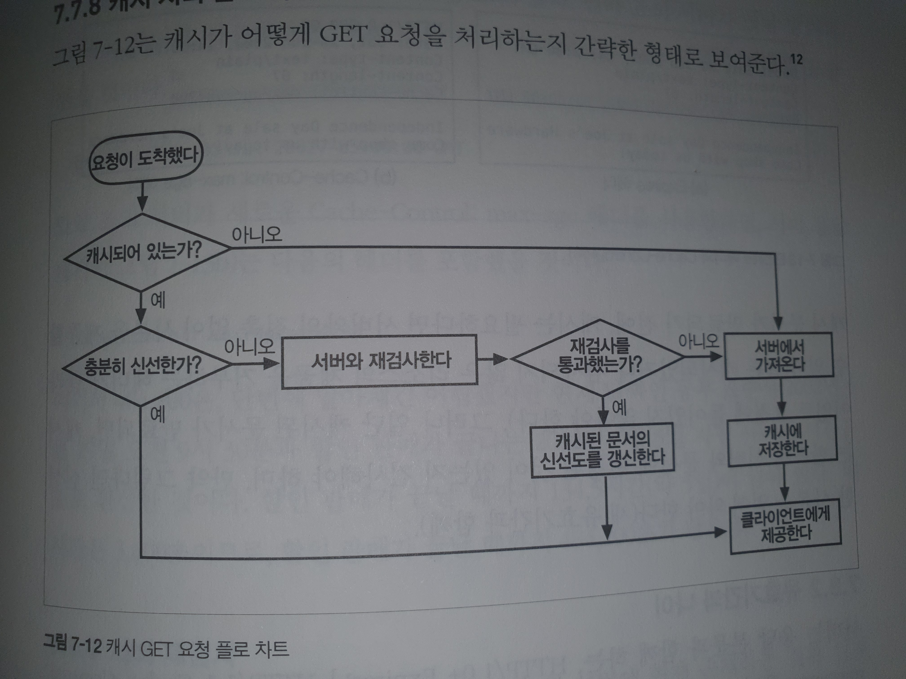
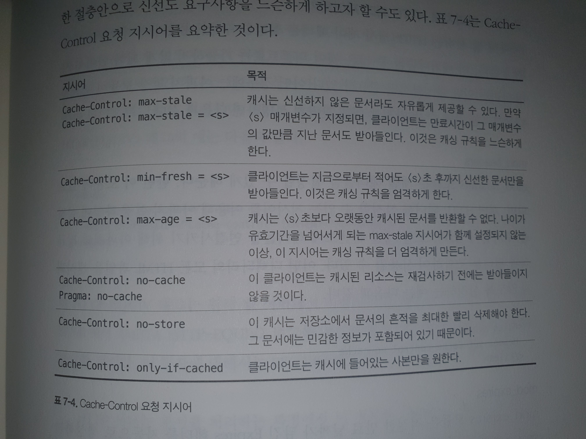

# 7장 캐시

특징
- 불필요한 데이터 전송을 줄임 (비용)
- 네트워크 병목을 줄여줌 (대역폭)
- 원 서버에 대한 요청을 줄임 (부하 분산)
- 거리로 인한 지연을 줄여줌 (거리)

### 7.1 불필요한 데이터 전송

사본을 응답에 사용 -> 트래픽 비용 감소

### 7.2 대역폭 병목

- 속도 기준은 원서버 <-> 클라이언트 속도 <<<< 캐시 <-> 클라이언트
- 캐싱을 통해 속도를 크게 개선

### 7.3 갑작스러운 요청 쇄도

- 요청이 예측하지 못하게 많이 들어오는 경우 과부하를 주기 때문에 캐시를 통해 부하분산

### 7.4 거리로 인한 지연

- 캐시는 바로 불러올 수 있지만, 실제 서버와의 거리가 있다면 불러오는데에 시간이 걸림

### 7.5 적중과 부적중

- 캐시에 데이터가 있을 경우 - 캐시 적중(cache hit)
- 캐시에 데이터가 없을 경우 - 캐시 부적중(cache miss)

##### 7.5.1 재검사

원 서버의 콘텐츠와 캐시 서버와의 콘텐츠의 차이를 점검하여 최신인지 확인

1. 캐시 서버 -> 원 서버 재검사 요청
2. 변경 없을 경우 304 Not Modified로 사본을 클라이언트에 제공 (개검사 적중, 느린 적중)
3. If-Modified-Since (캐시를 검사하는 헤더) - GET 헤더를 추가하면 우선 정해진 시간이 이후에 검사 요청

- 재검사 적중 : Not Moidified 반환
- 재검사 부적중 : HTTP 200 OK 응답을 보냄 및 콘텐츠 전차
- 객체 삭제 : 404 Not Found를 보내서 캐시 삭제

##### 7.5.2 적중률

캐시 적중률이 최대한 높을 수록 좋지만 40% 정도만 되어도 좋은 웹 캐시

##### 7.5.3 바이트 적중률

- 트래픽이 절감된 정도 -> 지연 시간 감소를 측정

##### 7.5.4 적중과 부적중의 구별

- Date 헤더를 통해서 현재 시각과 비교해서 생성일이 오래되었다면, 캐시 날림
- Age 헤더를 통해 확인

### 7.6 캐시 토폴로지

- 개인 전용 캐시
- 공용 캐시

##### 7.6.1 개인 전용 캐시

- 사용자가 개인 지정 가능한 캐시 (임시 파일)

##### 7.6.2 공용 프락시 캐시

- 공유하는 프락시 서버에 캐시 정보를 저장해서 사용자에게 제공
- 수동 Proxy Or Proxy 자동 설정을 통해 설정
- 인터셉트 Proxy -> 브라우저의 설정 없이 강제 (추후)

##### 7.6.3 프락시 캐시 계층들

- 프락시는 가장 가까운 계층부터 캐시를 찾는데 못 찾을 경우 상위 계층 프락시에 검색을 한다. 이 과정에서 상위로 올라갈스록 성능 저하가 급격해진다

##### 7.6.4 캐시망, 콘텐츠 라우팅, 피어링

캐시들이 가능한 것

- URL에 근거하여 부모 캐시와 원 서버 중 하나를 동적으로 선택
- URL에서 부모 캐시 중 하나를 선택
- 로컬에서 먼저 찾아봄
- 캐시 Content에 부분적 접근은 허용 but 다른 네트워크로 건너가는 것은 X

HTTP는 형제 캐시를 지원하지 않지만 인터넷 캐시 프로토콜 or 캐시 프로토콜(HTCP)는 지원 (20장)

##### 7.7 캐시 처리 단계

1. 요청 받기
2. 파싱 - 메시지 -> URL 헤더 추출
3. 검색 - 로컬에서 복사본 검색
    - 알고리즘을 사용해서 판단
4. 신선도 검사 - 선선도 파악 -> 신선하지 않으면 변경사항을 서버에게 물어봄
    - 신선도 검사 규칙? -> 뒤에 설명
5. 응답 생성
    - 헤더 생성 -> 응답에 맞게 반환
    - 신선도 정보 (Cache-Control, Age, Expires 헤더) 반환
    - Date 헤더는 건들면 X
6. 발송
7. 로깅
    - 스퀴드 로그 포맷
    - 넷스케이프 확장 공용 로그 포맷

### 7.8 신선도 유지

##### 7.8.1 문서 만료

Cache-Control 헤더와 Expires 헤더를 통해서 만료가 되면 신선한 사본을 얻어옴

##### 7.8.2 유효기간과 나이

- HTTP/1.0+ Expires(절대)나 HTTP/1.1 Cache-Control:max-age(상대)에서 응답 기간 명시

##### 7.8.3 서버 재검사

- 재검사 변경 시 -> 새로운 사본을 가져옴
- 비변경 시 -> 헤더만 갱신

캐시 서버가 반환 할 수 있는 종류

- 신선한 캐시 사본
- 에러 메시지 (원 서버 다운시)
- 경고 메시지가 있는 캐시 사본(부정확 시)

##### 7.8.4 조건부 메시드와의 재검사

조건부 헤더를 추가함으로써 재검사를 용이하게 함

- If-Modified-Since <date> 요청 날짜 이후로 수정될 경우 처리
- If-None-Match <tags> 태그가 다를 때만 처리

##### 7.8.5 If-Modified-Since : 캐시된 마지막 수정일

- 주어진 날짜 이후 변경 시 -> GET 요청을 반환
- 아닐시 -> Not Modified 응답 메시지를 클라이언트에게 반환

##### 7.8.6 If-None-Match: 엔터티 태그 재검사

위 방법이 안될 경우

- 문서가 일정간 간격으로 쓰여지는 문서
- 변경이 사소할 경우
- 변경 일시를 정확하게 판별 불가
- 1초 간격으로 변경 될 경우

태그에 버전 정보로 구분

##### 7.8.7 약한 엔티티 & 강한 엔티티

- 약한 검사기 - 사본을 무효화 시키지 않고 살짝 바뀐 것을 허용
- 강한 검사기 - 약간의 수정이 있어도 무조건 수정 (W/를 접두어로 붙임)

##### 7.8.8 언제 쓰는가?

- 클라이언트가 요청한 방법대로 사용
- 둘다 가능하면 둘다 가능

### 7.9 캐시 제어

얼마나 캐시가 될 것인가에 대한 우선 순위

1. Cache-Control:no-store
2. Cache-Control:no-cache
3. Cache-Control:must-revalidate
4. Cache-Control:max-age
5. Expire 날짜 헤더

##### 7.9.1 no-cache & no-store 헤더

- no-store -> 응답 사본 만들기 금지
- no-cache -> 로컬 캐시 저장소에 저장 금지

##### 7.9.2 Max-age 응답 헤더

- 서버에서 오고 흐른 시간이 넘을 경우
- s-maxage는 공유 헤더에서 적용

##### 7.9.3 Expires 응답 헤더

- 절대 시간을 명시
- 왠만하면 0쓰면 처리할수 있도록 해야하지만 쓰기 X

##### 7.9.4 Must-Revalidate 응답 헤더

- 해당 해더는 신선하지은 헤더는 재검사 없이 절대 제공 XX
- 원 서버가 사용 불가 -> 504 Timeout error 반환

##### 7.9.5 휴리스틱 만료

알아서 판단

- LM 알고리즘을 사용 : 마지막으로 변경한 것이 옛날 -> 안정적인 문서
- 최근에 변경 -> 자주 변경 : 짧게 캐싱

##### 7.9.6 클라이언트 제약

- 클라이언트가 강제로 재검사를 하게 할 수 있음 자세한 내용은 아래 그림

### 7.10 캐시 제어 설정

캐시 제어 예시

##### 7.10.1 아파치로 제어

- mod_headers라는 정규식과 필터를 조합해서 사용 (헤더 종류를 입력)
- mod_expires라는 적절한 만료 날짜가 담긴 Expires 헤더를 자동으로 생성하는 로직으로 조절

##### 7.10.2 HTTP-EQUIV를 통한 제어

- <META HTTP-EQUIV> 헤더를 통해서 헤더값 입력
- 하지만 대부분 지원 X -> 정적이고 HTML 빼고는 지원하지 않아서 비추천

### 7.11 자세한 알고리즘

- 불필요하다고 생각하여 스킵