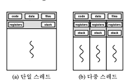
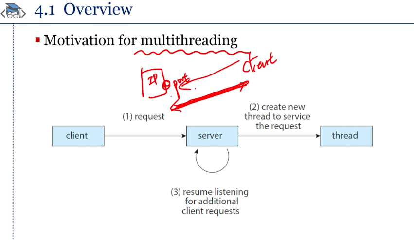
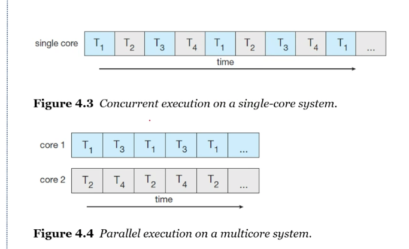

# Ch4 Thread & Concurrency

##### 쓰레드

- Thread : CPU 작업 단위





- 멀티스레딩의 장점
    1. 응답성 : 다중 스레드 프로그램 중 일부가 블록 되어도 나머지 부분은 실행 가능
    2. 자원 공유 : 메모리와 그 밖에 프로세스 자원을 공유
    3. 경제성 : 프로세스 내의 스레드는 자원을 공유
    4. 확장성 : 많은 장점을 가질 수 있음

- 자바로 쓰레드 구현하는 방법
    1. Thread 클래스 상속 받기
    2. Runaable 인터페이스 구현
    3. Runnable 람다 표현식 사용
    
    - 쓰레드의 종료 : interrupt();

- 멀티 코어에서 멀티 쓰레딩 돌리기
    - 싱글 코어 : 끼워 넣어서 번갈아가면서 실행
    - 멀티 코어 : 각 코어에서 병렬적으로 나눠서 Parrellel하게 실행



- 사용자가 직면한 멀티 코어 시스템 문제
    - 업무 인식 : 병렬 처리를 어떻게 코드 상에서 구현 하느냐
    - 균형 : 업무를 어떻게 균등하게 배분 하느냐
    - 데이터 쪼개기 : 각 코어에 데
이터 쪼개기
    - 데이터 의존성 : 데이터가 독립적으로 실행
    - 테스트 & 의존성

- 병렬 처리 종류 (지금은 안 중요)
    - 데이터를 코어를 분리
    - 업무 단위를 코어마다 분리

- 암날의 법칙
    - CPU 코어는 많을 수록 무조건 좋을 까요?
    - 많으면 좋지만 뒤로 갈수록 효율이 떨어짐

- 스레드 타입
    - 유저 쓰레드
        - 사용자 공간에서 제어하는 쓰레드
        - 커널 지원 없이 스케줄링, 관리 제공
        - 프로세스 별로 자체 스케쥴링 가능
    - 커널 쓰레드
        - os 단에서 직접 제어하는 쓰레드
        - 모드 변경이 있어야 스레드 생성/관리가 가능함

- 다중 스레드 모델
    - Many-to-One
    ```
    장점 : 사용자 모드에서 사용자 관리가 이루어짐 = 빠름
    단점 : 하나의 스레드가 블록 되면 프로세스가 블록 / 다중 프로세스 내에서 다중 스레드가 구현 불가
    ```
    - Many-to-Many
    ```
    장점: 비용이 일대일 모델보다 저렴, 다대일 모델과 달리 스레드 동시 수행 가능
    ```
    - One-to-One
    ```
    장점 : 하나의 스레드에 멈춰도 나머지에서 수행 가능
    단점 : 비용이 비싸다
    ```

##### 단어 설명

- Pthread 
    - thread를 관리하는 API를 관리하는 함수
- Thread Pool
    - 쓰레드를 만들어놓은 Pool에서 가져다 쓰는 개념
- Fork & Join
    - 명시적 쓰레딩을 암시적 쓰레딩으로 선언

- OpenMP
    - 컴파일러 한테 지시하면 병렬로 쓰레드로 돌아가게 작성