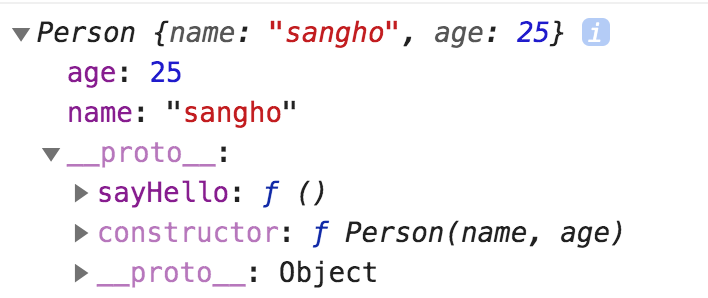
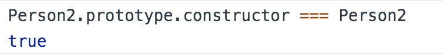
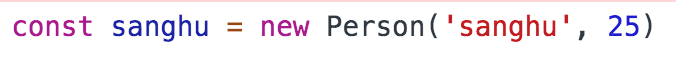
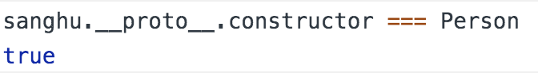
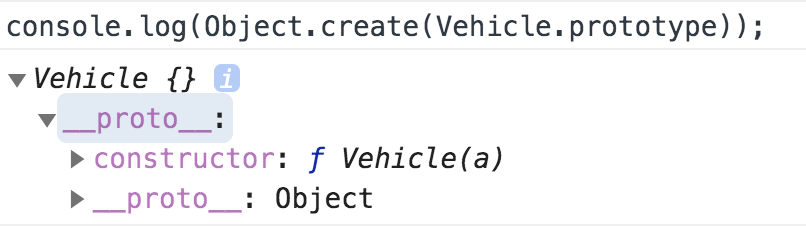
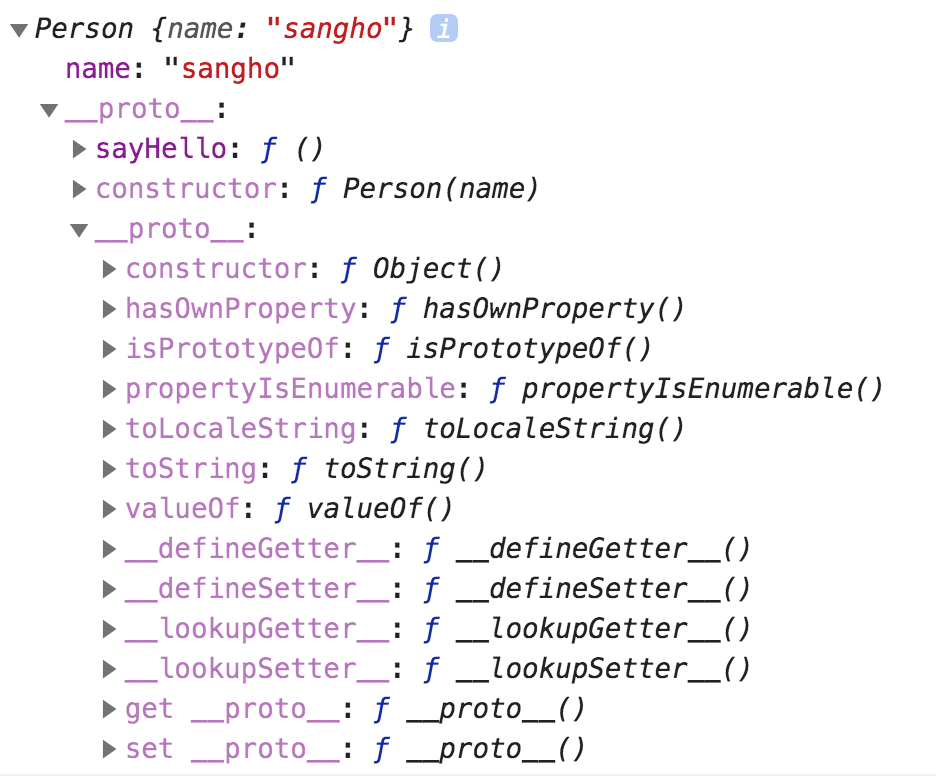

# 프토토타입과 클래스

자바스크립트도 다른 언어들처럼 객체지향언어이지만, 특이하게도 자바스크립트에는 클래스라는 개념이 없다. 대신 프로토타입(Prototype)이라는 것이 존재한다. 자바스크립트가 프로토타입 기반 언어라고 불리는 이유인데, 프로토타입을 기반으로 상속을 흉내내어 사용할 수 있다.

## 생성자 함수

생성자 함수란 **객체를 생성하는 함수** 이다.

다른 언어에는 `class`라는 개념이 있지만, 자바스크립트에는 없(었)기 때문에 생성자 함수가 그 역할을 대신한다.

간단한 예를 들어보자

```javascript
function Person(name, gender) {
  this.name = name;
  this.gender = gender;
  this.sayHello = function() {
    alert(this.name + ' said Hello');
  }
  ...
}
```

> 자바스크립트에서는 함수를 객체로 취급하기 때문에, 객체처럼 프로퍼티를 할당받을 수 있다.

함수를 만들 때처럼 `function` 키워드를 사용하지만, 함수와는 다르게 **대문자** 로 시작하게 만든다. 위 함수 안에 사용된 `this`는 생성자 함수 자신을 가리키게 된다. 이 생성자 함수를 바탕으로 실제 사람 객체를 만들 수 있다. `new` 키워드를 사용하여 호출하면 된다.

```javascript
const sangho = new Person('sangho', 'male'); // Person { name: 'sangho', gender: 'male' }
```

우리가 많이 사용하는 객체 리터럴 방식도 함수랑 전혀 상관없는 코드같지만, 실제로는 다음 두 줄의 코드는 같다.

```javascript
// same
var obj = {};
var obj = new Object();
```

<br>

## 프로토타입

```javascript
function Person(name, gender) {
  this.name = name;
  this.gender = gender;
}

Person.prototype.sayHello = function () {
  alert(this.name + ' said Hello');
};
```

위 Person 함수가 정의됨과 동시에, 다음 두 가지 일이 발생한다.

1. 해당 함수에 Constructor(생성자) 자격 부여

- Constructor 자격이 부여되면 new를 통해 객체를 만들어 낼 수 있게 된다.

2. 해당 함수의 Prototype Object 생성 및 연결

- 함수를 정의하면 함수만 생성되는 것이 아니라 Prototype Object도 같이 생성이 된다.

`prototype`은 의미 그대로 **원형**을 뜻하는데, 같은 생성자로부터 만들어진 객체들은 모두 이 원형 객체를 공유한다. 따라서 **prototype** 객체에 `sayHello` 메소드를 넣으면 Person 생성자로 만든 모든 객체들은 위 메소드 사용이 가능한 것이다.


<br>

## prototype과 \_\_proto\_\_

```javascript
const sangho = new Person('sangho', 'male');

console.log(sangho);
```

위와 같이 새로운 객체 하나를 만들고 콘솔로 객체를 출력해보면 우리가 추가한 프로퍼티말고도 `__proto__` 라는 프로퍼티를 볼 수가 있다. 이 프로퍼티를 클릭해보면



`constructor`와 직접 추가한 `sayHello` 그리고 또다시 `__proto__`가 있다.

\_\_proto\_\_가 바로 객체가 생성될 때 조상이었던 함수의 Prototype Object를 가리키는 것이다. 즉, 실제 객체를 만들 때 생성자의 prototype이 참조된 모습인 것이다. 생성자의 prototype을 참조하기 때문에 \_\_proto\_\_와 prototype은 같다. 아까 `Person.prototype.sayHello` 를 했던 것이 들어있고, 추가로 constructor(생성자)에 대한 정보까지 들어있다.

`__proto__` 안의 또 하나의 `__proto__`에 대해서는 뒤에서 다룰 것이다.

정리하자면

- constructor는 생성자 함수 그 자체를 가리킴
- prototype은 생성자 함수에 정의한 모든 객체가 공유할 원형
- \_\_proto\_\_는 생성자 함수를 new로 호출할 때, 정의해두었던 prototype을 참조한 객체
- \_\_proto\_\_는 new를 호출할 때 prototype을 참조하여 자동으로 만들어짐
- 생성자에는 prototype, 생성자로부터 만들어진 객체에는 \_\_proto\_\_
- 따라서 사용자는 prototype만 신경쓰면 된다. \_\_proto\_\_는 prototype이 제대로 구현되었는지 확인용으로 사용한다.

## prototype, \_\_proto\_\_ 와 constructor 의 관계

prototype과 constructor는 부모자식 관계라고 생각하면 된다. `Person.prototype.constructor === Person` 이다. 실제로 콘솔로 찍어보면 동일하다고 나온다.



또한 `Person.prototype === (Person 생성자 함수로 만든 객체).__proto__` 이기 때문에 `(Person생성자로 만들어진 객체).__proto__.constructor === Person` 도 성립한다.


<br>


## 상속의 필요성

위와 같이 생성자 함수를 만들고, new 키워드를 통해 객체도 만들었다. 추가로 Vehicle 이라는 생성자를 만들어보려한다.

```javascript
function Vehicle(name, speed) {
  this.name = name;
  this.speed = speed;
}

Vehicle.prototype.drive = function () {
  console.log(this.name + ' runs at ' + this.speed);
};
```

이렇게 Vehicle 생성자를 만들었다. drive 메소드로 달릴 수 있고, 이제 boost라는 메소드를 만들어서 최고 속도로 달릴 수 있는 기능을 추가하려 한다. 그래서 `Vehicle.prototype.boost = function () {...}` 이렇게 추가하자니 한 가지가 걸린다. Vehicle 안에는 트럭, SUV, 스포츠카, 세단 등 종류가 많은데 트럭과 같이 느린 차량은 boost 기능을 가지지 않도록 하고 싶다.

이럴 때 상속이 필요하다. 부모 생성자의 기능을 물려받는 동시에 새로운 기능을 추가할 수도 있는 **상속**에 대해 알아볼 것이다. Vehicle 생성자의 기능을 상속하고 확장한 Sedan 객체를 만들어보자.

## 상속

```javascript
// --- vehicle ---
function Vehicle(name, speed) {
  this.name = name;
  this.speed = speed;
}

Vehicle.prototype.drive = function () {
  console.log(this.name + ' runs at ' + this.speed);
};

var tico = new Vehicle('tico', 50);
tico.drive(); // 'tico runs at 50'

// --- sedan ---
function Sedan(name, speed, maxSpeed) {
  Vehicle.apply(this, arguments);
  this.maxSpeed = maxSpeed;
}

Sedan.prototype = Object.create(Vehicle.prototype);
Sedan.prototype.constructor = Sedan;

Sedan.prototype.boost = function () {
  console.log(this.name + ' boosts its speed at ' + this.maxSpeed);
};

var sonata = new Sedan('sonata', 100, 200);
sonata.drive(); // 'sonata runs at 100'
sonata.boost(); // 'sonata boosts its speed at 200'
```

조금 어려워보이는 듯한 코드지만, 이해하면 크게 어렵지 않다.

먼저 vehicle의 코드는 이미 익숙하므로 넘어가고, Sedan 생성자 함수의 코드 중 `Vehicle.apply(this, arguments)`는 Vehicle의 this들을 그대로 받으라는 뜻이다. 해석하자면 Vehicle 생성자에 Sedan의 this와 arguments를 적용하라는 코드인 것이다.

**apply()**는 `bind(), call()`과 같이 this 바인딩 용으로 쓰이는 메소드이다. 간단히 메소드를 호출하는 객체의 this를 사용자가 원하는 것으로 바꿔주는 것이라 생각하면 된다.

**arguments**는 객체를 생성할 때의 생성자 함수로 들어온 인수들(argument)을 뜻하는데, 즉 name, speed, maxSpeed가 모두 Vehicle과 연결되는 것이다. 다만, maxSpeed는 Vehicle에 없는 프로퍼티이니 무시된다.

이후 Sedan만 갖고 있는 maxSpeed 속성을 따로 추가한 것이다. 이렇게 Vehicle의 속성을 상속(또는 확장)받았고, 이제 메소드를 처리하는 부분을 보자.

생성자 아래의 `Sedan.prototype = Object.create(Vehicle.prototype);`은 Sedan의 prototype과 Vehicle의 prototype을 연결하는 것이다. 그래야 Vehicle의 메소드였던 drive()를 쓸 수 있다. `Object.create`는 `Vehicle.prototype`을 상속하는 새로운 객체를 만드는 메소드이다. 그 상속한 객체를 `Sedan.prototype`에 대입하므로 Sedan이 Vehicle을 상속하게 되는 것이다.

여기서 `Object.create(Vehicle.prototype)`과 `new Vehicle()`의 차이를 알아두면 좋다. `Object.create`는 객체를 만들되 생성자는 실행하지 않는다. 즉 그냥 프로토타입만 넣는다.



참고로 `Sedan.prototype.constructor = Sedan;`은 오류를 수정하는 코드이다. 위 설명 중에 `(생성자).prototype.constructor === (생성자)` 여야 한다고 언급했었는데, 생성자의 부모의 자식을 찾아라 하면 당연히 원래 생성자가 나와야한다. 하지만, 이 줄을 빼고 상속을 하면 위 코드와 같이 `Sedan.prototype.constructor === Vehicle`이 된다. 이건 어쩔 수 없는 자바스크립트의 문제이다. 그래서 이것을 고치기 위해 `Sedan.prototype.constructor`에 Sedan을 다시 넣어줌으로서 문제를 해결할 수 있다.

그 다음에 Sedan.prototype.boost 로 boost라는 메소드를 Sedan에 만들었다. 이제 Sedan은 Vehicle에게 상속받은 drive와 Vehicle 생성자를 확장한 자신의 boost 메소드를 쓸 수 있게 되었다.

<br>

## Object 객체

이번에는 모든 객체들의 최상위 부모 객체인 **Object 객체**에 대해서 알아볼 것이다. 이미 구현된 객체의 prototype을 확인할 때에는 위에서 보았듯이 \_\_proto\_\_ 를 사용하면 된다. Person 생성자의 \_\_proto\_\_ 를 확인해보았을 때, constructor와 직접 구현한 sayHello 메소드 외에 또 \_\_proto\_\_ 를 가진 것을 볼 수 있었다. 이 \_\_proto\_\_ 를 확인해보면 바로 이 것이 모든 객체들의 최상위 부모 객체인 Object 객체이다.

```javascript
function Person(name) {
  this.name = name;
}
Person.prototype.sayHello = function () {
  alert(this.name);
};
var sangho = new Person('sangho');
sangho.__proto__; // { sayHello: function() ... }
sangho.__proto__.__proto__; // Object { ... }
```



우리가 직접 생성자 함수를 통해 만든 객체 뿐만 아니라 모든 객체들은 **Object 객체** 를 최상위 부모 객체로 가진다. Object 객체의 \_\_proto\_\_ 는 **null** 값이다. 그 위로 상속받는 부모 객체가 없다는 뜻이다.

Object 객체의 생성자는 window 객체에 저장되어 있다. 모든 객체가 Object 객체로부터 상속받기 때문에 모든 객체는 `hasOwnProperty()` 등과 같은 Object 객체의 메소드들을 사용할 수 있게 된다.

---

## 참고

[ZeroCho 블로그](https://www.zerocho.com/category/JavaScript/post/573c2acf91575c17008ad2fc)
[오승환 블로그](https://medium.com/@bluesh55/javascript-prototype-%EC%9D%B4%ED%95%B4%ED%95%98%EA%B8%B0-f8e67c286b67)
