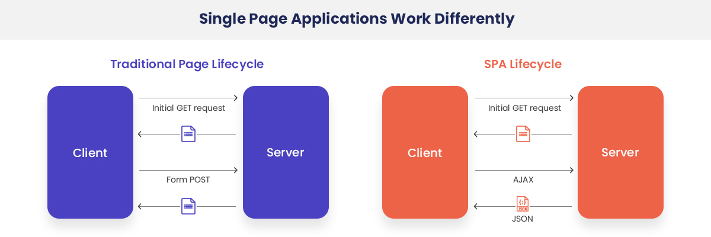
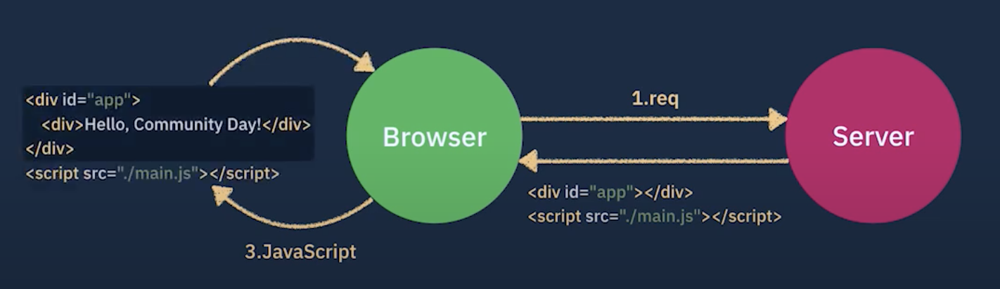
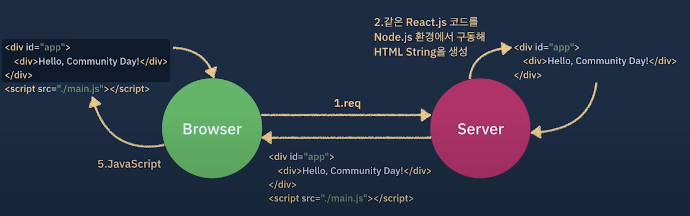

# SSR
- 페이지를 구성하는 작업이 서버에서 일어남
- 전통적인 웹 페이지 서빙 방식
- 작동 순서
    1. 클라이언트에서 서버에 요청이 들어온다
    2. 서버에서 완성된 html 페이지를 구성(렌더링)하여 응답한다
    3. 클라이언트는 받은 응답 페이지를 브라우저에 그려준다


## jQuery
```javascript
$( 'span' ).each(function() {
    $( this ).addClass( 'my-custom-class' );
});
```
- HTML의 클라이언트 사이드 조작을 단순화 하도록 설계된 크로스 플랫폼의 자바스크립트 라이브러리
- 장점
    * 엘리먼트를 선택하는 강력한 방법 제공
    * 선택된 엘리먼트를 효율적으로 제어하는 다양한 수단 제공


## Ajax(Asynchronous JavaScript and XML)
- 비동기적인 웹 애플리케이션의 제작을 위해 아래와 같은 조합을 이용하는 웹 개발 기법
    * 표현 정보를 위한 HTML (또는 XHTML) 과 CSS
    * 동적인 화면 출력 및 표시 정보와의 상호작용을 위한 DOM, 자바스크립트
    * 웹 서버와 비동기적으로 데이터를 교환하고 조작하기 위한 XML, XSLT, XMLHttpRequest (또는 JSON 등)
- 웹 페이지가 전체 페이지를 새로고침하지 않고도 서버를 호출하고, 응답을 처리하고, 페이지의 일부를 업데이트할 수 있음
- 반응성 향상: 모든 페이지 렌더링은 브라우저의 비용이 큼 -> JSON으로 일부 데이터만 변경 가능 -> 렌더링 비용 줄어듦
- jQuery에서 `$.ajax`과 같은 방식으로 손쉽게 사용 가능


## 클라이언트 고도화
- Template Engine의 등장: 뷰의 컴포넌트화 시작 ex. `handlebars`
- 템플릿 화 -> 라이브러리 화 -> 프레임워크 화
    * ex. `backbone.js`, `Angular.js`
    * MVC 패턴이 클라이언트 레벨에서 등장 
        + 클라이언트 라우팅
        + 템플릿, 모델, 이벤트 분리 및 관리 (데이터 레이어, 메모리 사용 등)
        + 뷰와 모델 양방향 데이터 바인딩 
        + 적극적인 모듈화로 코드 재사용을 편리하게 함
- SPA(Single Page Application)의 시대
    
    * SPA? 서버로부터 완전한 새로운 페이지를 불러오지 않고 현재의 페이지를 동적으로 다시 작성함으로써 사용자와 소통하는 웹 애플리케이션이나 웹사이트
    * 핵심 가치? 사용자 경험(UX) 향상 + 애플리케이션 속도 향상 -> 모바일 퍼스트(Mobile First) 전략에 부합


# CSR

- 페이지를 구성하는 작업이 클라이언트에서 일어남
- 작동 순서
    1. 클라이언트에서 서버에 요청이 들어온다
    2. 서버에서 정적 파일(bundle.js와 index.html등)을 응답한다
    3. 클라이언트의 자바스크립트 엔진이 `<script>`태그로 불러온 bundle.js 파일을 해석하여 화면에 그린다
- 장점
    * 클라이언트와 서버의 개발 업무 분리
    * 전체적인 트래픽 감소 (변경되거나 필요한 데이터만 서버에 요청하기 때문)
    * 빠른 반응 속도 (사용성, 반응성의 향상)
- 단점
    * 초기 화면 로딩 시간 필요 (url로 페이지 정보와 기능을 나누어 로드하는 `코드 스플리팅`으로 어느 정도 해소 가능)
- 유리한 분야
    * 화면수가 적고 이용 지속시간이 긴 경우 (ex. Facebook)
    * 어드민 페이지 등 주제가 명확하고, 화면 템플릿에 큰 변화가 없는 경우
    * 모바일 웹앱 (적은 리소스, 적은 템플릿으로 특정 장치에 동적 컨텐츠 제공할 수 있음)


# SSR vs CSR

1. 첫 로딩 시간
    * SSR: 짧음
    * CSR: html과 리소스(js etc.)를 받아오는 시간이 필요하기 때문에 초기 화면 구성에 시간이 필요함
2. 반응성 (interaction)
    * SSR: 새로운 페이지 요청이 있을 시 서버 통신 필요
    * CSR: 첫 뷰가 사용자에게 노출된 시점에서 바로 빠른 상호작용 가능
3. SEO (Search Engine Optimization, 검색 엔진 최적화)
    * SSR: 유리 (이미 완성된 페이지를 응답하기 때문에 크롤러가 정보를 읽기 간편함)
    * CSR: 불리 (개선된 Google Bot은 어느 정도 가능(그러나 `PrerenderIO` 사용 권고), 네이버의 Yeti는 불가능)
4. 문서 크기
    * SSR: HTML로 응답하기 때문에 SSR의 문서 크기가 항상 더 크다
    * CSR: 첫 로딩 이후엔 필요한 데이터(JSON etc.)만 받아오기 때문에 작음


# 다시, SSR
- 장점: 빠른 첫 로딩, SEO
- 유리한 분야
    * 화면 수가 많고 이용 시간이 짧은 경우 (ex. 은행)
    * 쇼핑몰, 뉴스 같이 컨텐츠 중심의 동적 페이지 기반 서비스 (내부 서버간 통신이 클라이언트와의 통신보다 효율적)
    * 검색 및 소셜 네트워크와 연동이 잦고 이들의 입지가 중요한 서비스
- 단점: 반응성, 문서 크기
- 융합!?
    * SSR (페이지 로딩) + CSR (이후 모든 페이지 로드)
        + 각 방법의 장점만 모아서 구성하자
    * 방법
        + React에서 직접 구현(node.js 등 사용, 클라이언트 사이드 라우팅 등 러닝 커브 있음, 라이브러리 비의존적)
        + next.js (사용자 설정이 거의 필요 없는 등 간단함)
        + cf. vue.js의 경우, nuxt.js


## Isomorphic Javascript (a.k.a. Universal Javascript)

- 노드js와 브라우저 환경 모두에서 동작할 수 있는 하나의 자바스크립트 코드
- 리액트가 SSR을 지원하기 편리한 이유
    * 기존 SPA의 경우 DOM에 접근하기 때문에 서버에서 렌더링 불가
    * 리액트는 Virtual DOM 을 사용하기 때문에 가능 (virtual DOM을 stringify하여 html로 만들면 됨)
- 단점
    * 사용자가 SSR 화면을 본 후에 실제 동작이 되기 까지는 시간이 걸림(CSR 동작이 끝날때까지)
    * SSR 도입 시, TTFB(Time To First Byte)가 CSR에 비해 느림 (SSR 과정에서 API 호출 및 render 시간 소요)
    TTFB 단축을 위해 사용자가 보는 부분만 SSR + 보이지 않는 부분은 CSR로 대응
    * 서버 리소스가 많이 들어감
- 주의
    * server render되는 코드에는 DOM API 사용하지 않도록 주의
    * 순수 javascript 만 사용해야 함
    * client에서만 지원하는 함수를 보완하는 library를 사용하거나 예외처리 하도록 작성


# Next.js
- Vercel에서 제공하는 리액트 프레임워크
- 특징
    * Hybrid Rendering (SSG(Static Site Generation), SSR, CSR라는 세 개의 렌더링 모드 제공)
        + SSG? SSR과 비슷하나 요청 시가 아니라 빌드 시에 페이지를 렌더링하는 방식 `ex. getInitialProps`
    * 보다 빠른 페이지 로드를 위해 코드 스플리팅 자동 적용
    * 라우팅
        + 내부에서 next/link, next/router 동작
        + 간단한 페이지 기반 client side 라우팅
        + Route pre-fetching 등
    * Zero config
        + 컴파일과 번들링이 자동화되어 있어서 설정의 번거로움이 적음
        + webpack, babel을 사용하여 확장 가능
    * 그 외: TypeScript support 등

# 참고 자료
- [어서 와, SSR은 처음이지?](https://d2.naver.com/helloworld/7804182)
- [Client-side rendering VS. Server-sde rendering](https://jongmin92.github.io/2017/06/06/JavaScript/client-side-rendering-vs-server-side-rendering/?fbclid=IwAR1thlPyzfCnIngeDTr25vAZQjxlJpILX3tMk0JiVH89zHEZqBusrxAiz3c#2)
- [The Next.js Handbook 번역](https://coffeeandcakeandnewjeong.tistory.com/5)
- React.js 개발자를 위한 SSR 앱 개발 및 배포하기 - 원지혁 (AUSG) :: AWS Community Day 2020
- [The Benefits of Server Side Rendering Over Client Side Rendering](https://medium.com/walmartglobaltech/the-benefits-of-server-side-rendering-over-client-side-rendering-5d07ff2cefe8)
- [왜 React와 서버 사이드 렌더링인가?](https://subicura.com/2016/06/20/server-side-rendering-with-react.html)
- [리액트에 대해서 그 누구도 제대로 설명하지 못한 것, 왜 Virtual DOM 인가? (번역)](https://velopert.com/3236)